# Tars

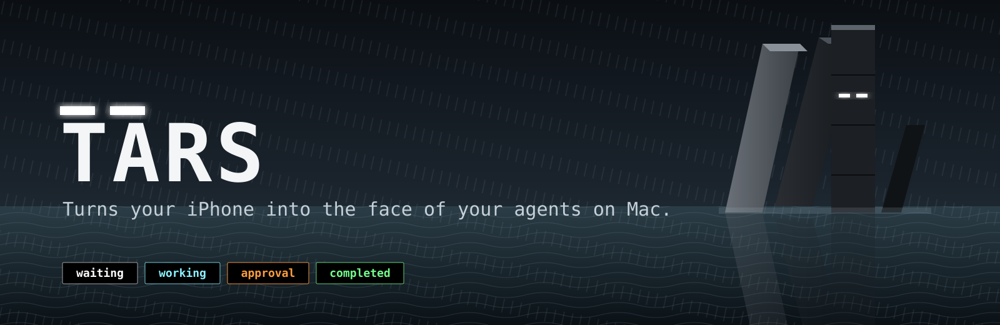

Turns your iPhone into the face of your agents on Mac. Inspired by *Interstellar*.

**English** · [中文](doc/README.zh-CN.md)

Two pixel eyes on a pure-black screen tell you, from across the room, whether Claude Code, Codex, opencode or pi is thinking, waiting for your approval, done, or idle.

| Waiting | Working | Approval | Completed |
|---|---|---|---|
| 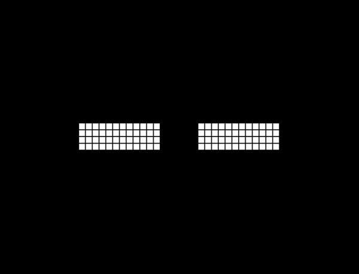 | 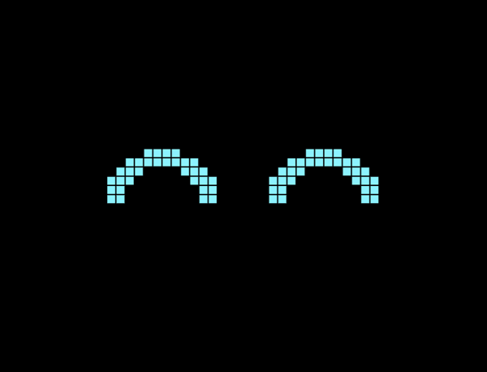 |  |  |

## What you get

- **iPhone app**: full-screen pixel-art face, keeps the screen awake, auto-rotates, AMOLED-friendly (background is always true black; state is carried by glyph shape and pixel colour).
- **Mac menu bar app**: discovers nothing, needs no account. It listens for agent lifecycle hooks, reduces them to one state, and pushes that to paired phones over your local network via Bonjour.
- **Agent hooks, not log scraping**: the same approach as [codestatus](https://github.com/henriquegpb/codestatus). Claude Code, Codex, opencode and pi call a tiny hook script on every lifecycle event; nothing else is watched.
- **Detail line**: under the eyes, the current tool, the pending question, or the last assistant message, clipped to two lines.
- **Pairing**: a six-digit code shown on the Mac, entered once on the phone.

## Quick start

1. **Mac**: build and install the menu bar app (or grab a Release build).

   ```zsh
   xcodebuild -project Tars.xcodeproj -scheme TarsMac -configuration Release -derivedDataPath .build/mac build
   cp -R .build/mac/Build/Products/Release/TarsMac.app /Applications/Tars.app && open /Applications/Tars.app
   ```

2. **Connect your agents**: in the Mac app, Settings (⌘,) → *Agents*, switch on Claude Code, Codex, opencode or pi. Codex additionally needs you to run `/hooks` inside Codex once and trust the Tars entries.

3. **iPhone**: open `Tars.xcodeproj` in Xcode, pick your team under Signing & Capabilities, select the phone, run. Allow Local Network access when asked.

4. **Pair**: the phone asks for a PIN two seconds after launch if it isn't paired yet. Read the code from the Mac's Settings window and enter it. It's remembered.

Start a new agent session and the eyes come alive. Sessions that were already open before step 2 keep their old hook set until restarted.

## How it works

```
Claude Code / Codex / opencode / pi ──hook──▶ ~/.tars/bin/tars-hook ──loopback 17894──▶ Tars.app ──Bonjour/TCP 17893──▶ iPhone
```

**Hook** ([Mac/hook.py](Mac/hook.py)). Reads one JSON payload from stdin, projects it to a hashed session key, a normalized state, and one clipped detail line, and pushes that to `127.0.0.1:17894` with a 50 ms budget. It always exits 0 and is registered `async` for Claude Code, so it can never block or fail the agent.

**Installer** ([Mac/install-hooks.py](Mac/install-hooks.py)). Stages one hook copy per agent at `~/.tars/bin/` (no spaces: Codex splits commands on whitespace; the file name carries the agent name for agents that drop hook arguments), then wires each agent its own way:

| Agent | Wired through | Registered as |
|---|---|---|
| Claude Code | `~/.claude/settings.json` | `async` command hook entry |
| Codex | `~/.codex/hooks.json` | command hook entry, trusted via `/hooks` |
| opencode | `~/.config/opencode/plugin/tars.js` | [plugin](Mac/opencode-plugin.js) (`event`, `chat.message`, `tool.execute.before`, `permission.ask`) |
| pi | `~/.pi/agent/extensions/tars.ts` | [extension](Mac/pi-extension.ts) (`session_start`, `before_agent_start`, `tool_call`, `message_end`, `agent_end`, `session_shutdown`) |

For the JSON agents, ownership is by exact command path, so user hooks are never touched, and the config file is backed up alongside itself before every write. For opencode and pi, Tars owns exactly one file of its own and removes only that file; a copy left over from an older Tars reads as off, so toggling the agent back on refreshes it. Both adapters translate their agent's events into the same payload the hook already reads from Claude Code, so all the state mapping stays in `hook.py`.

```zsh
/usr/bin/python3 Mac/install-hooks.py install          # every agent
/usr/bin/python3 Mac/install-hooks.py remove codex     # one agent
/usr/bin/python3 Mac/install-hooks.py status
```

**State model.** Events map to four phone states, with priority approval → working → completed → waiting across all live sessions.

| Event | State |
|---|---|
| SessionStart, StopFailure, Notification(idle_prompt) | waiting |
| UserPromptSubmit, PreToolUse, PostToolUse, PostToolUseFailure, PermissionDenied, ElicitationResult, Pre/PostCompact | working |
| PermissionRequest, Notification(permission_prompt), Elicitation, and PreToolUse of `AskUserQuestion` / `ExitPlanMode` | approval |
| Stop | completed (held 5 s) |
| SessionEnd | session removed |

A silent session expires after 30 minutes because hooks provide no liveness query. A turn you interrupt keeps its last state until you type again, since Claude Code's `Stop` hook does not fire on cancellation.

**Transport.** The Mac advertises `_tars._tcp`. The phone connects, sends `{"code":"123456"}` as its first line, and then receives newline-delimited JSON snapshots: server session UUID, monotonic sequence, state, source availability, heartbeat interval, detail. A wrong code gets `{"error":"unpaired"}` and a close. Heartbeats every 20 s while active, 120 s while idle. The phone reconnects with bounded backoff and disconnects while backgrounded.

**Privacy.** What crosses the socket and the LAN: a SHA-256 prefix of the session id, the state word, and one line of detail text (tool name plus its description/command/path, the pending question, or the last assistant message, ≤160 chars). Nothing is written to disk. If you don't want task text on the phone, the detail line is one function in `hook.py`.

## Themes

Pick the eyes under Settings → *Style*. Every theme is original pixel art drawn from 12×12 bitmaps in [iOS/Theme.swift](iOS/Theme.swift); no licensed imagery is used, the names are homages. Picking a theme also selects its palette, which you can still override.

**Eva** – angled slits that light up green when working, a hollow-pupil stare for approval.

| Waiting | Working | Approval | Completed |
|---|---|---|---|
| 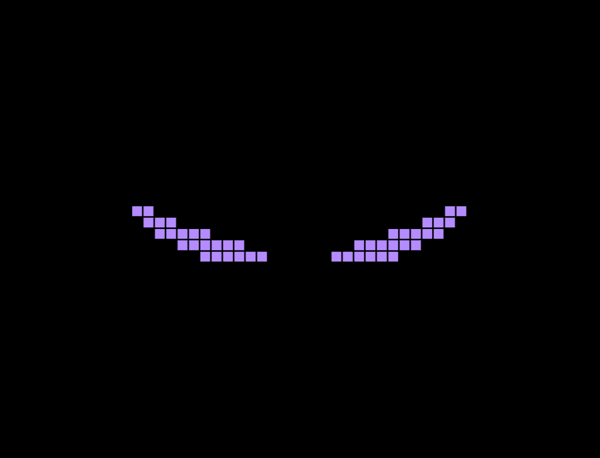 | 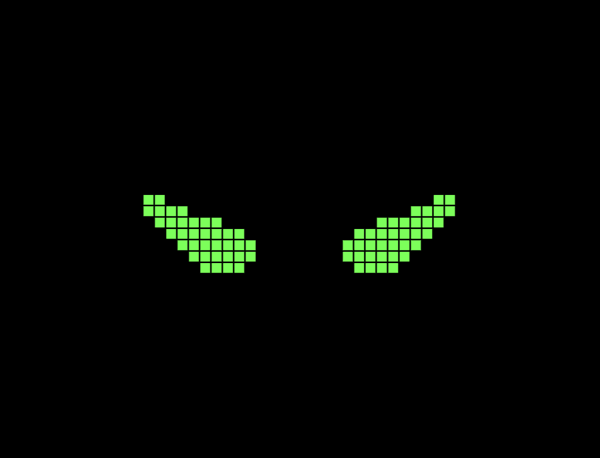 | 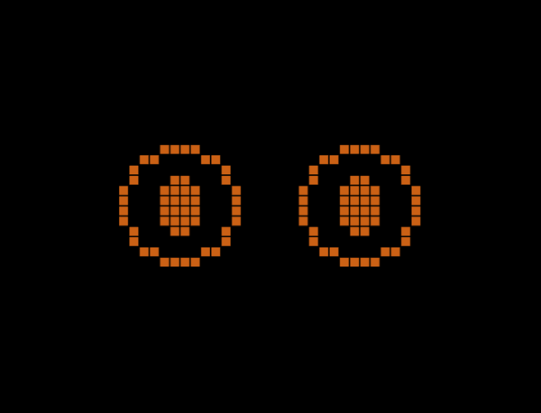 | 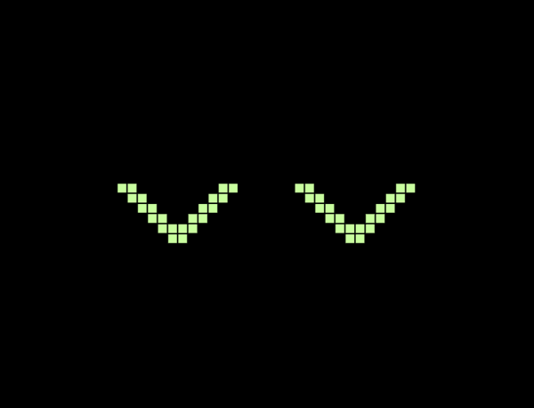 |

**Pika** – round yellow eyes with a highlight, a lightning bolt for approval, sparkles when done.

| Waiting | Working | Approval | Completed |
|---|---|---|---|
| 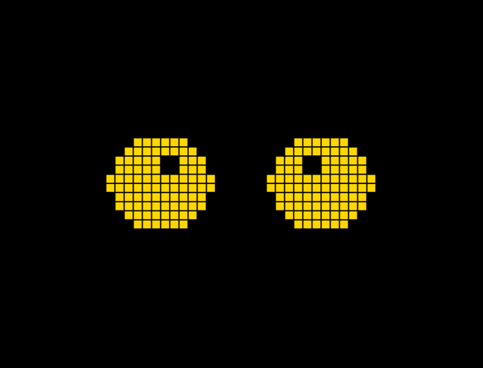 | 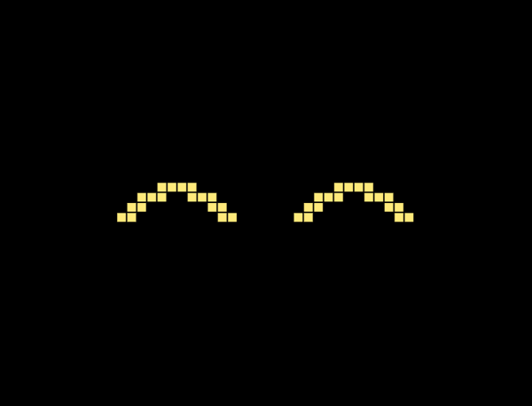 | 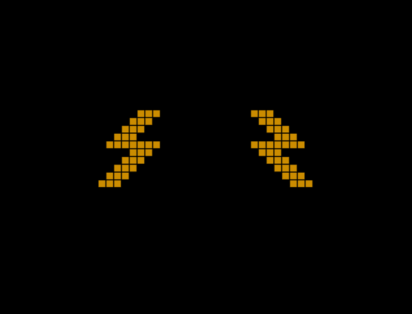 | 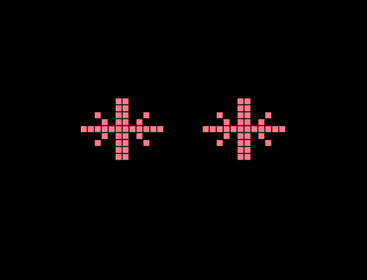 |

**Miku** – tall teal eyes with a highlight, a music note while working, a wide stare for approval, sparkle when done.

| Waiting | Working | Approval | Completed |
|---|---|---|---|
| 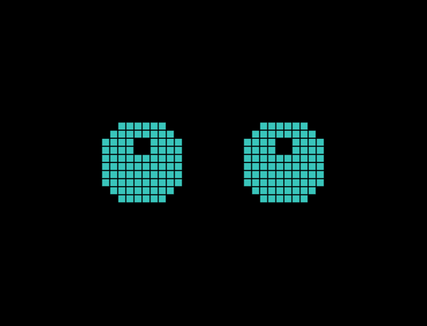 | 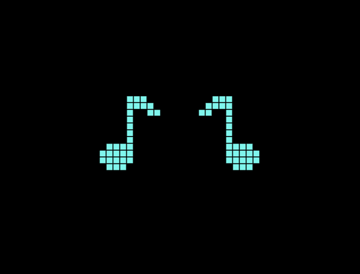 | 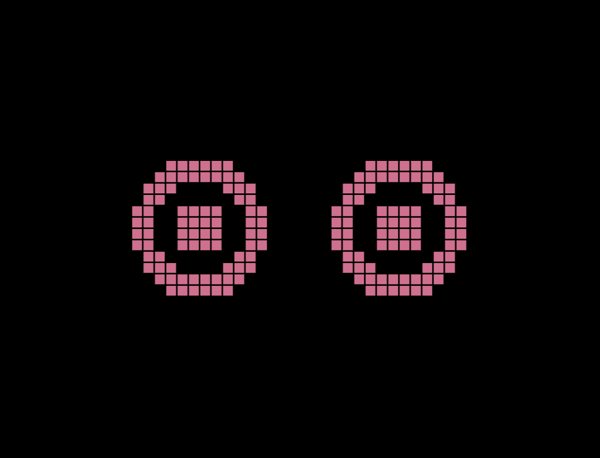 | 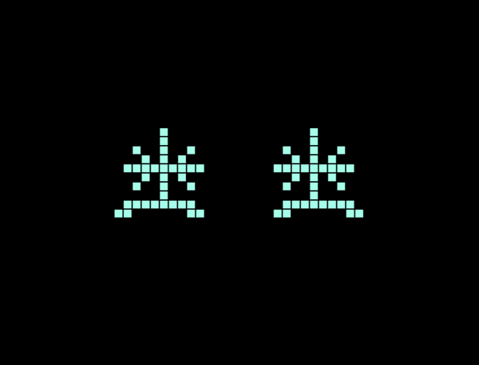 |

**Naruto** – a determined eye under a headband line, a chakra spiral while working, a three-tomoe ring for approval, a closed grin when done.

| Waiting | Working | Approval | Completed |
|---|---|---|---|
| 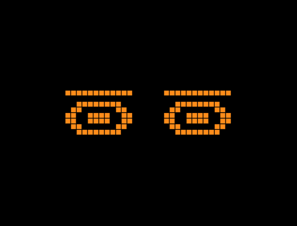 | 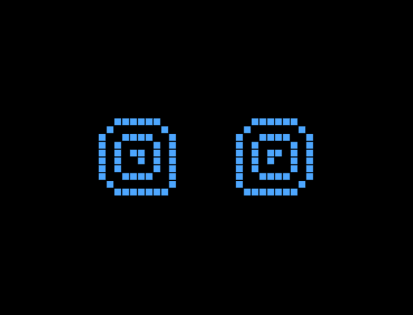 | 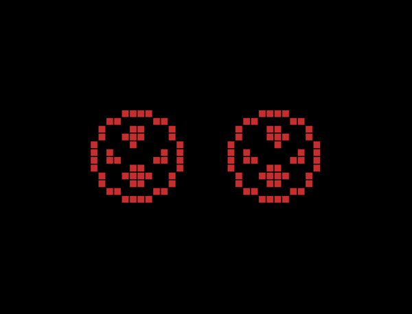 | 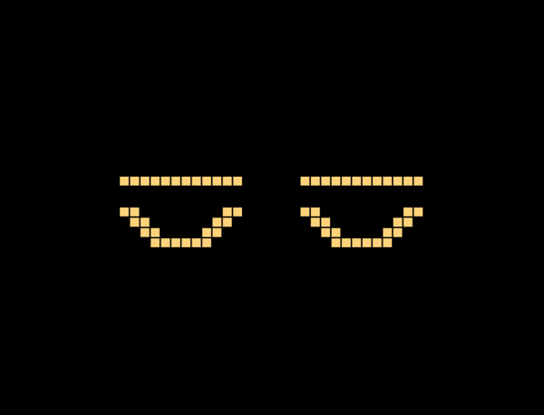 |

**Xiaohei** – round cat eyes with a vertical slit pupil; narrowed while working, wide and golden for approval, content arcs when done.

| Waiting | Working | Approval | Completed |
|---|---|---|---|
| 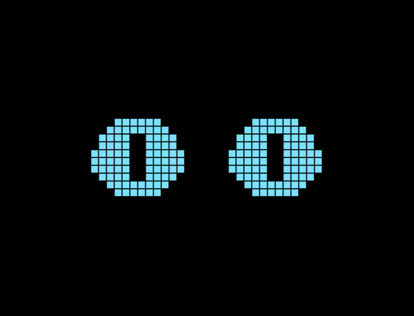 | 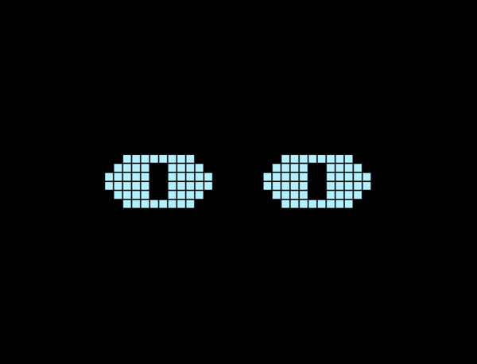 | 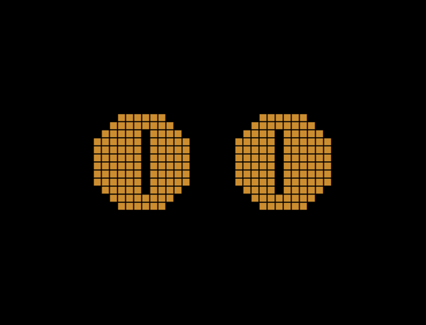 | 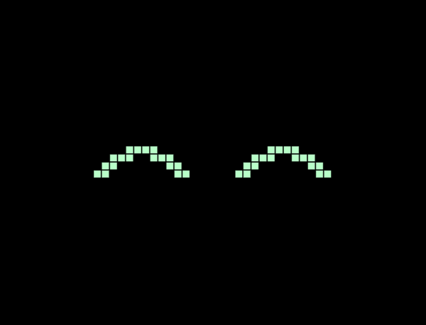 |

**Dora** – big oval eyes whose hollow pupils wander: centred at rest, down while working, wide for approval, crescents when done.

| Waiting | Working | Approval | Completed |
|---|---|---|---|
| 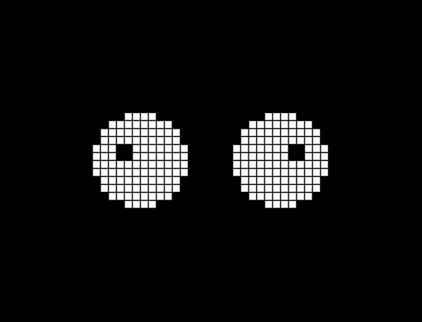 | 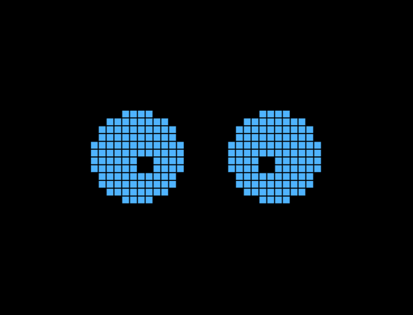 | 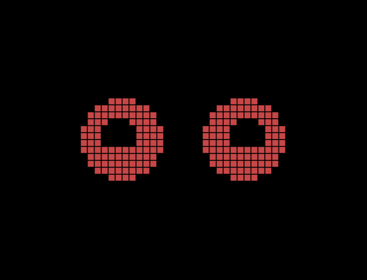 | 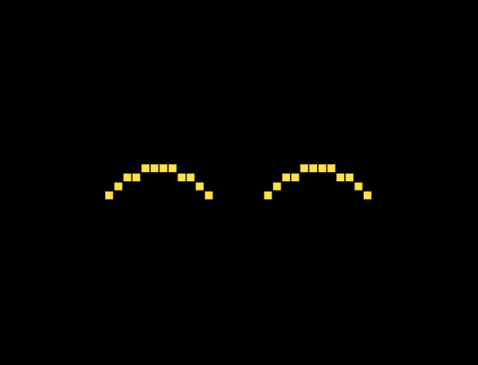 |

**Snoopy** – tiny bead eyes; a raised brow while working, a startled brow for approval, closed happy eyes when done.

| Waiting | Working | Approval | Completed |
|---|---|---|---|
| 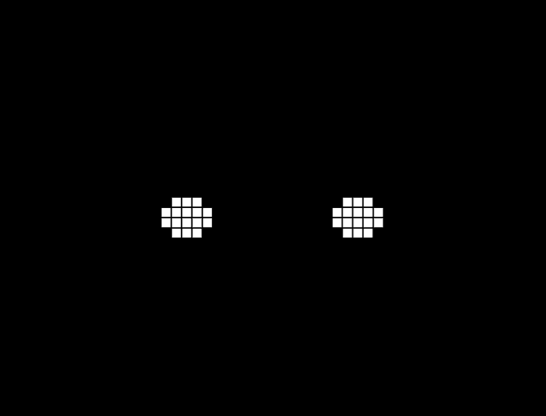 | 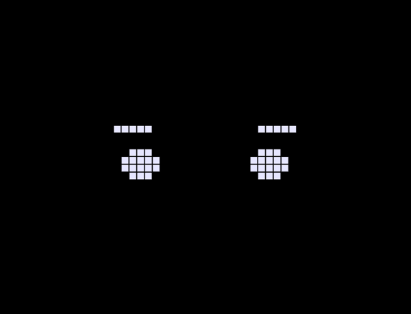 | 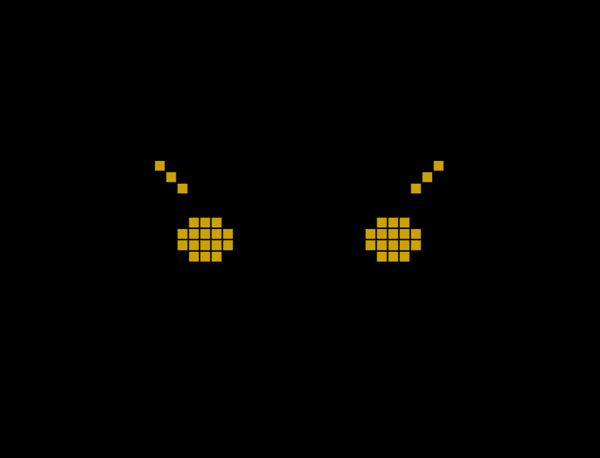 | 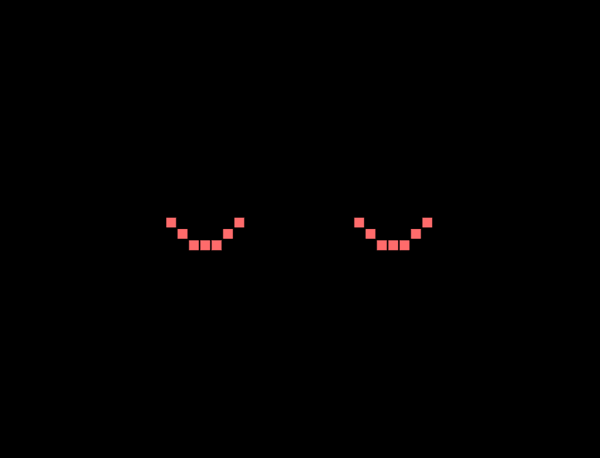 |

To add one: a new case in `Theme` with five bitmaps and a palette preset, plus pictures under `themes/<name>/`.

## Settings

**iPhone** (tap the screen, then ⚙):

- *Pairing code*: the six digits from the Mac.
- *Style*: eyes theme (Bit, Eva, Pika, Miku, Naruto, Xiaohei, Dora, Snoopy).
- *Colors*: presets Terminal Green, Windows Blue, Techno White, or Custom with a colour per state. Approval stays warm in every preset so it still signals.
- *Saving battery*: reduce motion; dim to minimal light 10 s after the last update (any event or tap restores it); reduce refresh rate (slower animation cadence, also triggered by Low Power Mode).

**Mac** (menu bar item → Settings…):

- *Pairing*: the code, a "New code" button, last paired/rejected phone, and *Development mode* which streams to any phone without a code.
- *Agents*: Claude Code, Codex, opencode and pi toggles.
- *Startup*: launch at login, hide the window after startup, show/hide the menu bar item. With the menu bar item hidden, reopen Tars from Applications to get the window back.

## Building

The Xcode project is generated from [project.yml](project.yml); run `xcodegen generate` only after changing it. Targets: `Tars` (iOS 17+) and `TarsMac` (macOS 15+).

```zsh
# iPhone simulator, no signing
xcodebuild -project Tars.xcodeproj -scheme Tars -sdk iphonesimulator \
  -destination 'generic/platform=iOS Simulator' -derivedDataPath .build/iOS CODE_SIGNING_ALLOWED=NO build

# Bare CLI server instead of the menu bar app
./Mac/run.zsh                # development mode, no pairing
./Mac/run.zsh --code 123456  # require this pairing code
```

Debug builds of the phone app accept `--preview-state waiting|working|approval|completed` for screenshots; preview never connects to a server.

## Tests

```zsh
/usr/bin/python3 Tests/test_hook.py
/usr/bin/python3 Tests/test_install_hooks.py
xcrun swiftc Mac/Server.swift Mac/EventSource.swift Mac/main.swift -o /tmp/tars-server
python3 Tests/test_server.py /tmp/tars-server
```

The server test uses ports 27893/27894 and checks snapshots, fragmented input, priority, sequence numbers, the five-second completion hold, reconnect, and input limits.

## Layout

```
iOS/        SwiftUI phone app (FaceView, AgentLink, Palette)
MacApp/     SwiftUI menu bar app (settings, hook installer UI)
Mac/        Server + EventSource (shared), CLI main, hook.py, install-hooks.py,
            opencode-plugin.js, pi-extension.ts
Tests/      hook and installer unit tests, server integration test
themes/     reference pictures per theme (bit, eva, pika)
doc/        translations
```

## Known limits

- Free Apple ID signing expires after 7 days; reinstall from Xcode.
- Bonjour needs the phone and Mac on the same network; it reflects reachability, not distance.
- Only Claude Code, Codex, opencode and pi are wired. Other agents can send the same JSON to port 17894.
- pi has no approval event of its own, so a pi session waiting on a tool confirmation still reads as working.
- No encryption on the LAN link. Use it on a network you trust.
