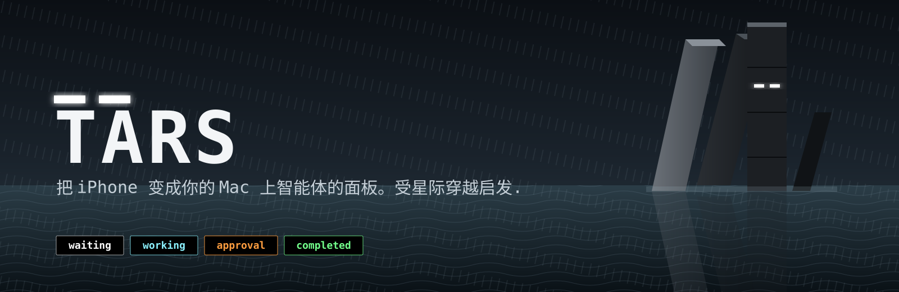

# Tars



把 iPhone 变成你的智能体的脸。灵感来自《星际穿越》。

[English](../README.md) · **中文**

把一台闲置的 iPhone 变成编程智能体的常亮状态面板。纯黑屏幕上的两只像素眼睛，让你隔着房间就能看出 Claude Code 或 Codex 正在思考、等你批准、已完成，还是空闲。

| 等待 | 工作中 | 待批准 | 已完成 |
|---|---|---|---|
|  |  |  |  |

## 你会得到什么

- **iPhone 应用**：全屏像素风脸孔，保持常亮，自动横竖屏，AMOLED 友好（背景永远是纯黑，状态由字形和像素颜色表达）。
- **Mac 菜单栏应用**：无需账号。它监听智能体的生命周期钩子，归纳为一个状态，通过 Bonjour 在局域网内推送给已配对的手机。
- **钩子而非日志抓取**：与 [codestatus](https://github.com/henriquegpb/codestatus) 相同的思路。Claude Code 和 Codex 在每个生命周期事件上调用一个极小的钩子脚本，除此之外不监视任何东西。
- **详情行**：眼睛下方显示当前工具、待回答的问题或最后一条助手消息，最多两行。
- **配对**：Mac 上显示六位配对码，手机输入一次即可。

## 快速开始

1. **Mac**：构建并安装菜单栏应用（或使用 Release 构建）。

   ```zsh
   xcodebuild -project Tars.xcodeproj -scheme TarsMac -configuration Release -derivedDataPath .build/mac build
   cp -R .build/mac/Build/Products/Release/TarsMac.app /Applications/Tars.app && open /Applications/Tars.app
   ```

2. **连接智能体**：在 Mac 应用中打开 设置（⌘,）→ *Agents*，打开 Claude Code 和/或 Codex。Codex 还需要你在 Codex 内运行一次 `/hooks` 并信任 Tars 的条目。

3. **iPhone**：用 Xcode 打开 `Tars.xcodeproj`，在 Signing & Capabilities 里选择你的团队，选中手机，运行。弹出提示时允许“本地网络”访问。

4. **配对**：如果尚未配对，手机启动两秒后会弹出 PIN 输入框。从 Mac 的设置窗口读取配对码并输入，之后会记住。

新开一个智能体会话，眼睛就会动起来。在第 2 步之前已经打开的会话仍使用旧的钩子集，需重启才会生效。

## 工作原理

```
Claude Code / Codex ──钩子──▶ ~/.tars/bin/tars-hook ──本机 17894──▶ Tars.app ──Bonjour/TCP 17893──▶ iPhone
```

**钩子**（[Mac/hook.py](../Mac/hook.py)）。从 stdin 读取一条 JSON 载荷，投影为哈希后的会话键、归一化状态和一行裁剪后的详情，在 50 ms 预算内推送到 `127.0.0.1:17894`。它永远以 0 退出，并在 Claude Code 中以 `async` 方式注册，因此绝不会阻塞或拖垮智能体。

**安装器**（[Mac/install-hooks.py](../Mac/install-hooks.py)）。把钩子放到 `~/.tars/bin/`（路径无空格：Codex 会按空白分割命令），并注册到 `~/.claude/settings.json` 和 `~/.codex/hooks.json`。归属判断依据是命令路径完全相等，因此绝不会碰用户自己的钩子；每次写入前都会在原文件旁边做备份。

```zsh
/usr/bin/python3 Mac/install-hooks.py install          # 两个智能体
/usr/bin/python3 Mac/install-hooks.py remove codex     # 单个智能体
/usr/bin/python3 Mac/install-hooks.py status
```

**状态模型。** 事件映射到手机上的四种状态，多个活动会话之间的优先级为：待批准 → 工作中 → 已完成 → 等待。

| 事件 | 状态 |
|---|---|
| SessionStart、StopFailure、Notification(idle_prompt) | 等待 |
| UserPromptSubmit、PreToolUse、PostToolUse、PostToolUseFailure、PermissionDenied、ElicitationResult、Pre/PostCompact | 工作中 |
| PermissionRequest、Notification(permission_prompt)、Elicitation，以及 `AskUserQuestion` / `ExitPlanMode` 的 PreToolUse | 待批准 |
| Stop | 已完成（保持 5 秒） |
| SessionEnd | 移除该会话 |

由于钩子不提供存活查询，静默 30 分钟的会话会被过期移除。你中断的一轮对话会保持最后状态直到你再次输入，因为 Claude Code 的 `Stop` 钩子在取消时不会触发。

**传输。** Mac 通过 Bonjour 广播 `_tars._tcp`。手机连接后首行发送 `{"code":"123456"}`，随后接收按行分隔的 JSON 快照：服务端会话 UUID、单调递增序号、状态、事件源是否可用、心跳间隔、详情。配对码错误会收到 `{"error":"unpaired"}` 并被断开。活动时每 20 秒一次心跳，空闲时 120 秒。手机采用有上限的退避重连，进入后台时断开。

**隐私。** 经过套接字和局域网的内容只有：会话 id 的 SHA-256 前缀、状态词，以及一行详情文本（工具名加其描述/命令/路径、待回答的问题，或最后一条助手消息，≤160 字符）。不会写入磁盘。如果你不希望任务文本出现在手机上，详情行只是 `hook.py` 里的一个函数。

## 设置

**iPhone**（点击屏幕，再点 ⚙）：

- *配对码*：Mac 上的六位数字。
- *颜色*：预设 Terminal Green、Windows Blue、Techno White，或自定义每个状态的颜色。所有预设中“待批准”都保持暖色，以便一眼识别。
- *省电*：减少动态效果；最后一次更新 10 秒后调暗到最低亮度（任何事件或点击都会恢复）；降低刷新率（更慢的动画节奏，低电量模式也会触发）。

**Mac**（菜单栏图标 → Settings…）：

- *配对*：配对码、“New code”按钮、最近一次配对/拒绝的手机，以及 *Development mode*（无需配对码向任何手机推送）。
- *Agents*：Claude Code 和 Codex 开关。
- *启动*：登录时启动、启动后隐藏窗口、显示/隐藏菜单栏图标。隐藏菜单栏图标后，从“应用程序”重新打开 Tars 即可找回窗口。

## 构建

Xcode 工程由 [project.yml](../project.yml) 生成；仅在修改它之后才需要运行 `xcodegen generate`。目标：`Tars`（iOS 17+）和 `TarsMac`（macOS 15+）。

```zsh
# iPhone 模拟器，无需签名
xcodebuild -project Tars.xcodeproj -scheme Tars -sdk iphonesimulator \
  -destination 'generic/platform=iOS Simulator' -derivedDataPath .build/iOS CODE_SIGNING_ALLOWED=NO build

# 使用纯命令行服务端替代菜单栏应用
./Mac/run.zsh                # 开发模式，无需配对
./Mac/run.zsh --code 123456  # 要求此配对码
```

手机应用的 Debug 构建支持 `--preview-state waiting|working|approval|completed` 用于截图；预览模式不会连接服务端。

## 测试

```zsh
/usr/bin/python3 Tests/test_hook.py
xcrun swiftc Mac/Server.swift Mac/EventSource.swift Mac/main.swift -o /tmp/tars-server
python3 Tests/test_server.py /tmp/tars-server
```

服务端测试使用 27893/27894 端口，检查快照、分片输入、优先级、序号、五秒完成保持、重连和输入上限。

## 目录结构

```
iOS/        SwiftUI 手机应用（FaceView、AgentLink、Palette）
MacApp/     SwiftUI 菜单栏应用（设置、钩子安装界面）
Mac/        Server + EventSource（共享）、命令行入口、hook.py、install-hooks.py
Tests/      钩子单元测试、服务端集成测试
themes/     各主题的参考图片；themes/bit 是当前外观
doc/        翻译
```

## 已知限制

- 免费 Apple ID 签名 7 天后过期，需从 Xcode 重新安装。
- Bonjour 要求手机和 Mac 在同一网络；它反映的是可达性，而非物理距离。
- 目前只接入了 Claude Code 和 Codex。其他智能体可以向 17894 端口发送相同的 JSON。
- 局域网链路未加密，请在可信网络中使用。
